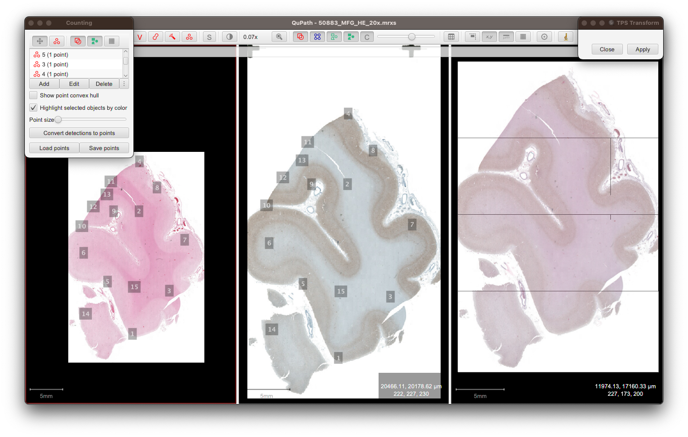

# QuPath TPS extension (Fork of QuPath Warpy Extension)

## Updates

This repo adds direct support for registering, viewing, and exporting images with non-linear deformation, specifically `ThinPlateR2LogRSplineKernelTransform` (with support for more general RealTransforms in the pipeline), in QuPath. The restriction to BioFormats image servers, and to registering the image externally in ImageJ, is removed. This extension implements the registration fully in QuPath, by providing the landmark mappings to a live TPSTransformServer, meaning that any ImageServer can be sampled at the pixel level to visualize it under TPS deformation, and similarly overlaid, handled, and exported as any other ImageServer in QuPath.

The repo depends upon the inspiration of the QuPath Warpy Extension (rest of their README below) and BigWarp, and functionally depends on imglib2 and jitk-tps.

The image registration may be performed in several ways; scripts for the registration interface are available, with plans to further integrate this functionality into an extension similar to the ImageAlignmentPane or ImageCombinerWarpyPane. At this time the most functional usage is achieved by opening three columns of viewers in QuPath, with the first two holding the images to be aligned, and the third blank (filled by the warp overlay when in use). Once suitably aligned the image may be exported as any other; once a ServerBuilder is added it may also be safely added as a ProjectImageEntry. The script for this is located at `scripts/tpsUtil.groovy`.




## Installing

Download the latest `qupath-extension-warpy-[version].zip` file from [releases](https://github.com/biop/qupath-extension-warpy/releases). Unzip it, then and drag its contained files onto the main QuPath window.

If you haven't installed any extensions before, you'll be prompted to select a QuPath user directory.
The extension will then be copied to a location inside that directory.

You might then need to restart QuPath (but not your computer).

## Citing

https://doi.org/10.3389/fcomp.2021.780026

## Building

You can build the QuPath Warpy extension from source with

```bash
gradlew clean build
```

The output will be under `build/libs`.

* `clean` removes anything old
* `build` builds the QuPath extension as a *.jar* file and adds it to `libs` 
